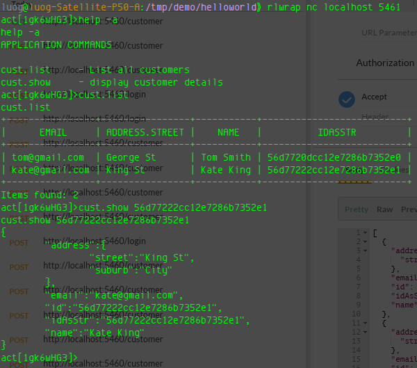
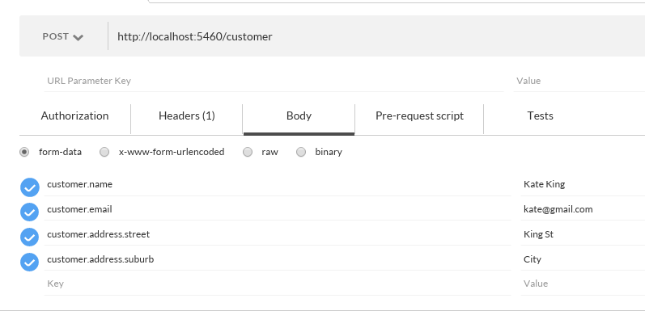
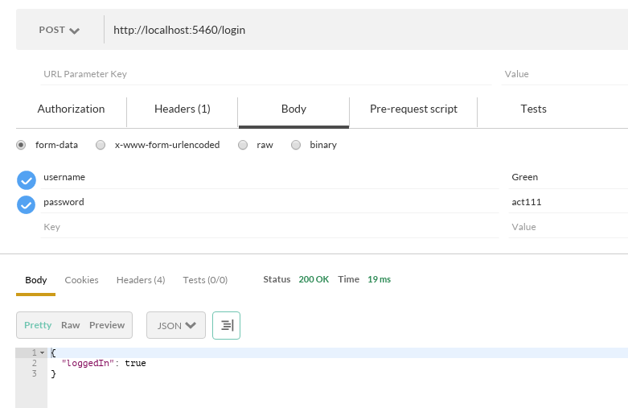
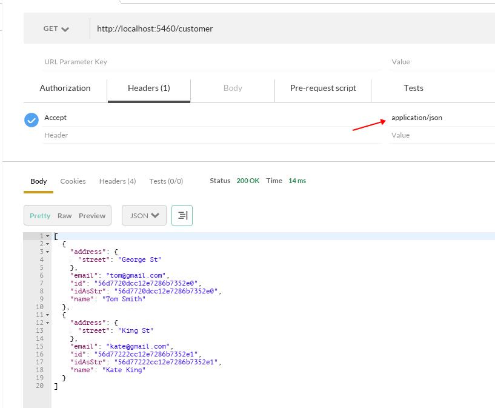

# ActFramework Demo App

This is the application I've presented on [Sydney JVM Meetup](http://www.meetup.com/Sydney-JVM-Community/events/228633164/)

## How to run it:

1. Start the app

    ```
    mvn clean compile exec:exec
    ```

1. Check browser: open http://localhost:5460

1. Check console:

    ```
    telnet localhost 5461
    help
    cust.list
    ```

    

1. Login

    This app has built-in very simple authentication, you will get redirected to login page if you haven't logged in. Just type in any username and any password string contains "act" to login

1. Create customer
    
    Use tool like [Postman](https://www.getpostman.com/) to help you create customer:

     

    **Note** before create customer in postman, make sure you login in postman. Just post to /login with username and password parameter to login

         

1. Get customer

    

## Code size

http://cloc.sourceforge.net v 1.60  T=0.03 s (343.1 files/s, 10602.5 lines/s)
-------------------------------------------------------------------------------
Language                     files          blank        comment           code
-------------------------------------------------------------------------------
Java                             5             40             15            175
HTML                             5              0              0             79
-------------------------------------------------------------------------------
SUM:                            10             40             15            254
-------------------------------------------------------------------------------

